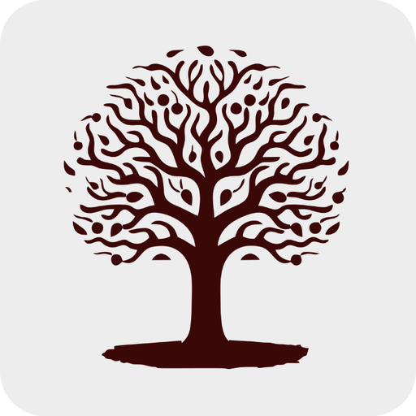

<div align="center">

<br>



# Taskee

**Minimalist Task & Notes Manager for Android & iOS**

Organize your tasks. Capture your thoughts. Stay on top of what matters.

<br>


<br>

</div>

---

## Overview

Taskee is a Flutter mobile app designed for effortless productivity. Manage your to-dos and notes in one place — with local-first storage, smart notifications, and a clean dark-themed UI that stays out of your way.

---

## Features

| Feature                       | Description                                                                                      |
| ----------------------------- | ------------------------------------------------------------------------------------------------ |
| **Task Management**           | Create, update, complete, and delete tasks with due dates and time scheduling                    |
| **Notes**                     | Quickly jot down notes alongside your tasks, all in one app                                      |
| **Smart Notifications**       | Get reminders at your scheduled due time — auto-cancelled when a task is marked complete         |
| **Undo Delete**               | Accidentally deleted a task? Restore it instantly with one tap                                   |
| **Persistent Tab State**      | Remembers your last active tab so you're always where you left off                               |
| **Offline-First Storage**     | All data stored locally using Hive — no internet connection required                             |
| **Clean Dark UI**             | Polished dark theme with Google Fonts and smooth swipe interactions                              |
| **Lightweight & Fast**        | Native performance on both Android and iOS with minimal battery and storage footprint            |

---

## Tech Stack

| Layer             | Technology                      |
| ----------------- | ------------------------------- |
| Framework         | Flutter (Dart)                  |
| State Management  | Bloc / Cubit                    |
| Local Storage     | Hive + Hive Flutter             |
| Notifications     | Flutter Local Notifications     |
| Routing           | GoRouter                        |
| Dependency Injection | GetIt                        |
| UI Components     | Material Design 3 + Google Fonts |

---

## Getting Started

### Prerequisites

- [Flutter SDK](https://docs.flutter.dev/get-started/install) v3.0 or higher
- [Dart](https://dart.dev/get-dart) — bundled with Flutter

### Installation

**1. Clone the repository**

```bash
git clone https://github.com/your-username/taskee
```

**2. Navigate to the project directory**

```bash
cd taskee
```

**3. Install dependencies**

```bash
flutter pub get
```

**4. Generate Hive adapters**

```bash
dart run build_runner build --delete-conflicting-outputs
```

**5. Run the app**

```bash
flutter run
```

---

## Project Structure

```
taskee/
├── lib/
│   ├── main.dart                   # App entry point
│   ├── app/
│   │   ├── routing/                # GoRouter navigation setup
│   │   ├── theme/                  # Colors, typography & theme
│   │   ├── extension/              # Dart extensions (context, size, etc.)
│   │   └── helper/                 # Validators & utilities
│   ├── di/
│   │   └── dependency_injection.dart  # GetIt service locator
│   └── features/
│       ├── todo/                   # Task feature (data, domain, presentation)
│       │   ├── data/               # Hive models, mappers, datasource, notifications
│       │   ├── domain/             # Entities, use cases, repository contracts
│       │   └── presentation/       # Bloc, pages & widgets
│       ├── note/                   # Notes feature (same clean architecture)
│       └── shared/                 # Shared cubit (e.g. tab state)
├── assets/
│   └── logo.png                    # App icon & assets
├── test/                           # Unit & widget tests
├── pubspec.yaml                    # Dependencies & configuration
└── README.md
```

---

## Architecture

Taskee follows **Clean Architecture** with a clear separation of concerns across three layers:

- **Data** — Hive local data sources, Hive models, and mappers
- **Domain** — Pure Dart entities, repository interfaces, and use cases
- **Presentation** — Bloc/Cubit for state management, pages, and widgets

---

## Contributing

Contributions are welcome. To get started:

1. Fork the repository
2. Create a new branch — `git checkout -b feature/your-feature-name`
3. Commit your changes — `git commit -m 'Add some feature'`
4. Push to the branch — `git push origin feature/your-feature-name`
5. Open a Pull Request

---

## License

This project is licensed under the [MIT License](LICENSE).

---

## Author

**Your Name**

- Email: your@email.com
- LinkedIn: [linkedin.com/in/your-profile](https://www.linkedin.com/in/your-profile/)

---

<div align="center">
<sub>Built with Flutter &mdash; Taskee &copy; Your Name</sub>
</div>
